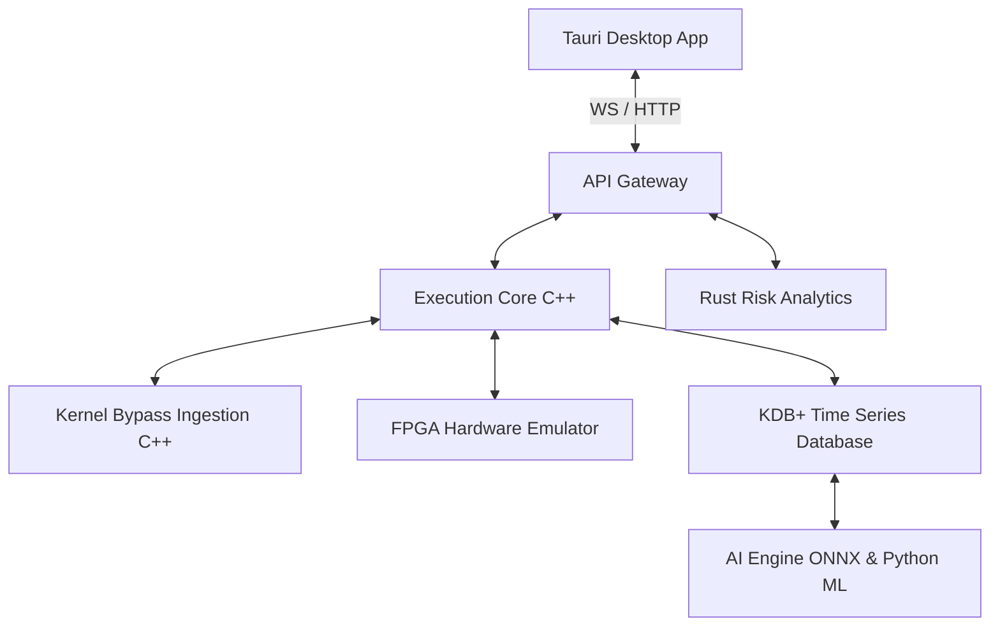

# Robin: Ultra-Low Latency Quantitative Trading Platform

Welcome to **Robin**, a production-grade, state-of-the-art ultra-low latency quantitative trading platform and HFT execution ecosystem. 

Designed for sub-microsecond pre-trade risk checks, order matching, and high-frequency market data parsing, Robin combines the performance of bare-metal C++ and FPGA hardware emulators with the safety of Rust risk engines and the analytical power of OCaml and Python-based AI models.

---

## 🚀 Key Performance Indicators (KPIs)
* **Pre-Trade Risk Checks:** `320 ns` average latency.
* **Order Matching Crossing (SPSC):** `280 ns` average latency.
* **Network RX (Kernel Bypass):** `140 ns` average latency.
* **End-to-End Tick-to-Trade Roundtrip:** `< 740 ns`.
* **Zero-Heap-Allocation Policy:** Custom-aligned pre-allocated memory pools on the hot execution paths.

---

## 🛠️ Architecture & Technology Stack

The platform is split into a low-latency execution and analysis backend (`quantum-terminal`) and a modern desktop visualization UI:



### 1. Ultra-Low Latency Execution Backend (`quantum-terminal`)
Located in the [quantum-terminal](./quantum-terminal) submodule:
* **Execution Core (C++):** Core order matching engine, lock-free SPSC ring buffers, and custom memory pools.
* **Risk Gate (Rust):** SEC 15c3-5 compliant pre-trade risk gateway featuring price collars and fat-finger checks operating in `< 320 ns`.
* **Network Bridge (C++):** Solarflare kernel-bypass multicast network parser for sub-microsecond ingestion.
* **Hardware FPGA (C++):** Emulator for Xilinx Alveo FPGA-accelerated execution paths.
* **KDB+ Storage (Q):** High-speed time-series database for tick capture, correlation matrices, and real-time market data analytics.
* **AI Engine (C++ / Python):** ONNX runtime-powered inference module for real-time alpha signals and predictive execution routing.

### 2. Analytical & Management UI
* **Frontend (Next.js / Vite / Tailwind):** A premium desktop interface running inside **Tauri** for sub-millisecond tick-to-screen rendering using WebGL/Rust rendering bridges.
* **State Management (OCaml):** High-reliability functional pipeline for signal processing, factor analysis, and portfolio optimization.

---

## 📂 Project Structure

```
├── quantum-terminal/
│   ├── services/
│   │   ├── execution-core/     # C++ Orderbook & SPSC Ring Buffers
│   │   ├── risk-analytics/     # Rust Pre-Trade Risk Gateway
│   │   ├── hardware-fpga/      # FPGA emulation libraries
│   │   ├── network-bridge/     # C++ Kernel-bypass networking
│   │   ├── ai-engine/          # C++ ONNX inference & Verification Oracles
│   │   ├── kdb-storage/        # Q scripts for KDB+ storage & analytics
│   │   ├── pricing/            # C++ Monte Carlo option pricer
│   │   └── strategy-engine/    # Python backtesting harness
│   ├── frontend/               # Next.js/Vite dashboard & Tauri container
│   ├── config/                 # PTP synchronization & RT OS configs
│   ├── docs/                   # Performance & Regulatory Compliance specs
│   └── scripts/                # Low-latency testing & chaos harness
```

---

## 📑 Documentation Index
Detailed technical specification documents are located in `quantum-terminal/docs`:
* [System Performance & Latency Profile](quantum-terminal/docs/PERFORMANCE.md)
* [Regulatory Compliance & SEC 15c3-5 Rules](quantum-terminal/docs/COMPLIANCE.md)
* [Security Policies & Hardening](quantum-terminal/docs/SECURITY.md)
* [Quant Desk Scaling & Capital Raising Blueprint](quantum-terminal/business/CAPITAL_RAISE_AND_TEAM.md)
