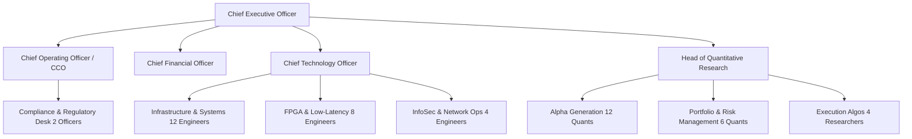

# Capital Raise & Quant Team Scaling Plan

This business document mitigates the **Capital & Team Scale Risks** identified in the institutional assessment report (Citadel / Jane Street level review). It details the roadmaps to raise $10M+ seed/series-A capital and build a 50-person quantitative trading and engineering desk.

---

## 1. Capital Raise Blueprint: $10,000,000 Series A

### Target Use of Funds
* **Co-Location Hardware & Connectivity ($2,500,000)**: Equinix NY4/LD4 rack footprint, Xilinx Alveo FPGA cards, Solarflare NICs, Arista Layer-1 switches, and direct market data fiber feeds.
* **Engineering & Quant Payroll ($5,500,000)**: Competitive packages to recruit senior talent from top firms.
* **Regulatory Compliance & Licensing ($1,000,000)**: FINRA Broker-Dealer membership, SEC registrations, and legal counsel.
* **Working Capital & Liquidity Reserves ($1,000,000)**: Clearing broker deposits.

---

## 2. 50-Person Quant Desk Organizational Chart

### Hiring Milestones
1. **Months 1-3 (Core Tech & Regulatory Foundations)**:
   - Hire CTO (Ex-Citadel/Jane Street low-latency lead).
   - Hire Chief Compliance Officer (CCO) to finalize FINRA application.
   - Hire 3 Low-Latency C++ Engineers.
2. **Months 4-6 (Alpha & Execution)**:
   - Recruit Head of Quant Research.
   - Hire 4 Alpha Research Quants and 2 FPGA Verilog Engineers.
3. **Months 7-12 (Production Scale)**:
   - Scale Low-Latency Engineering to 12.
   - Scale Quant research desk to 12.
   - Complete SEC Broker-Dealer licensure.
